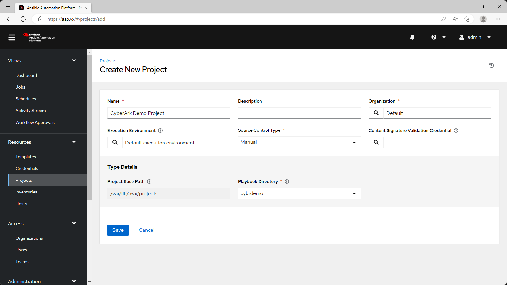
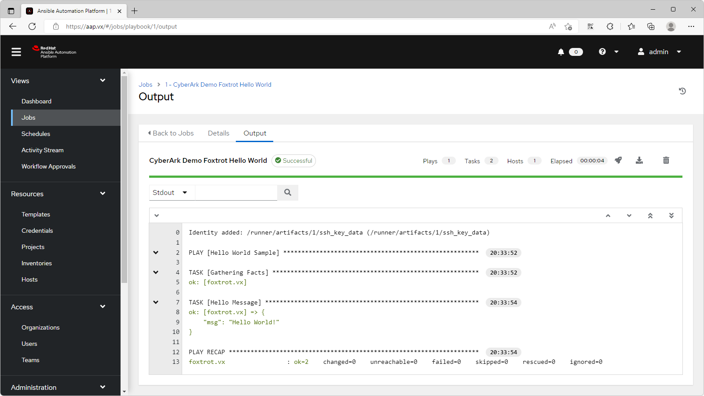

# Integrate Ansible Automation Platorm with CCP and Conjur
## Introduction
- The Ansible Automation Platorm can integrate with both CCP and Conjur products under the CyberArk secrets manager solution
- This guide demonstrates the integration between AAP and CyberArk.

### Software Versions
- RHEL 9.0
- Ansible Automation Platorm 2.2
- Ansible Automation Controller 4.2.1
- PAM/CCP 12.6
- Conjur Enterprise 12.7.0

### Servers

| Hostname | Role |
| --- | --- |
| cybr.ark.vx | CCP server |
| conjur.vx | Conjur master |
| aap.vx | Ansible Automation Controller |
| foxtrot.vx | Ansible managed node |

# 1. Setup Ansible Automation Platorm

## 1.1. Setup PostgreSQL server

- AAP requires a PostgreSQL server (Ref: [Red Hat Ansible Automation Platform system requirements](https://access.redhat.com/documentation/en-us/red_hat_ansible_automation_platform/2.2/html/red_hat_ansible_automation_platform_installation_guide/planning-installation#automation_controller))

### 1.1.1. Setup PostgreSQL server:
- Install PostgreSQL server
- Change authentication for `127.0.0.1/32` to `md5` (i.e. allow password authentication for local connections)
- Set PostgreSQL server to start on boot
- Allow PostgreSQL service on firewalld
```console
yum -y install postgresql-server
postgresql-setup --initdb
sed -i 's/host    all             all             127.0.0.1\/32            ident/host    all             all             127.0.0.1\/32            md5/' /var/lib/pgsql/data/pg_hba.conf
systemctl enable --now postgresql
firewall-cmd --add-service postgresql --permanent && firewall-cmd --reload
```

### 1.1.2. Setup PostgreSQL database:
- Login to PostgreSQL server: `sudo -i -u postgres psql`
- Create user `awx` with password `Cyberark1`
- Create database `awx`
```console
CREATE USER awx WITH SUPERUSER PASSWORD 'Cyberark1';
CREATE DATABASE awx;
\q
```

### 1.1.3. Optional: Clean-up PostgreSQL history
```console
rm -f /var/lib/pgsql/.psql_history
```

## 1.2. Install AAP

- Retrieve the latest AAP installer from your Red Hat subscription
- Ref: [Installing automation controller with a database on the same node](https://access.redhat.com/documentation/en-us/red_hat_ansible_automation_platform/2.2/html/red_hat_ansible_automation_platform_installation_guide/single-machine-scenario#standalone-controller-non-inst-database)

- Extract the AAP installer and change directory into the extracted folder
```console
tar xvf ansible-automation-platform-setup-bundle-2.2.1-1.tar.gz
cd ansible-automation-platform-setup-bundle-2.2.1-1
```

### 1.2.1. Edit the inventory file
- Add the hostname of the controller under `[automationcontroller]`
```console
⋮
[automationcontroller]
aap.vx ansible_connection=local
⋮
```

- **Note** ☝️ : do not use `127.0.0.1` as the host even if you're running it on localhost and the Red Hat docs says to use `127.0.0.1`, use the hostname of your controller instead. 

- Attempting to use `127.0.0.1` will result in below failure:
```console
TASK [ansible.automation_platform_installer.check_config_static : Preflight check - Fail if Automation Controller host is localhost] ***
failed: [127.0.0.1 -> localhost] (item=127.0.0.1) => {"ansible_loop_var": "item", "changed": false, "item": "127.0.0.1", "msg": "The host specified in the [automationcontroller] group in your inventory file cannot be localhost. Please update your inventory file properly."}
```

- Set a password for the AAP admin login
- Set the PostgreSQL server details
```console
⋮
[all:vars]
admin_password='Cyberark1'

pg_host='127.0.0.1'
pg_port=5432

pg_database='awx'
pg_username='awx'
pg_password='Cyberark1'
pg_sslmode='prefer'  # set to 'verify-full' for client-side enforced SSL
⋮
```

- Set the container registry login credentials for the installer to push the execution environment container images
```console
⋮
# Execution Environment Configuration
⋮
registry_url='registry.redhat.io'
registry_username='my_red_hat_username'
registry_password='my_red_hat_password'
⋮
```

- Set the AAP SSL certificate (if you have any)
```console
⋮
# SSL-related variables

# If set, this will install a custom CA certificate to the system trust store.
custom_ca_cert=/tmp/certificate_authority.pem

# Certificate and key to install in nginx for the web UI and API
web_server_ssl_cert=/tmp/aap.pem
web_server_ssl_key=/tmp/aap.key
⋮
```

### 1.2.2. Run the setup script
```console
./setup.sh
```

## 1.3. Prepare Ansible playbooks

- The default directory for manual SCM is in `/var/lib/awx/projects`
- Prepare the directory and download the demo playbooks
  - `helloworld.yaml` - this is a sample from Ansible
  - `webserver.yaml` - this installs apache web server in the managed node and deploy the `index.html` from `index.html.j2` template
- **Note** ☝️ : the `sudo -i -u awx` part of the commands is crucial, this runs the commands as `awx` user, so that we won't encounter permission issues on the directory/playbooks

```console
sudo -i -u awx mkdir /var/lib/awx/projects/cybrdemo
sudo -i -u awx curl -o /var/lib/awx/projects/cybrdemo/helloworld.yaml https://raw.githubusercontent.com/ansible/ansible-tower-samples/master/hello_world.yml
sudo -i -u awx curl -o /var/lib/awx/projects/cybrdemo/webserver.yaml https://raw.githubusercontent.com/joetanx/cybr-aap/main/webserver.yaml
sudo -i -u awx curl -o /var/lib/awx/projects/cybrdemo/index.html.j2 https://raw.githubusercontent.com/joetanx/cybr-aap/main/index.html.j2
```

## 1.4. First login to AAP
- Login to the AAP and [import a subscription](https://docs.ansible.com/automation-controller/latest/html/quickstart/import_license.html)

## 1.5. Configure inventory, host, and project in AAP

- Ref: [Automation Controller Quick Setup Guide](https://docs.ansible.com/automation-controller/latest/html/quickstart/quick_start.html)

- Configure an inventory: `CyberArk Demo Inventory`


- Configure the managed node in this inventory


- Configure a project: `CyberArk Demo Project`
  - Organization: `Default`
  - Execution Environment: `Default execution environment`
  - Source Control Type: `Manual`
  - Playbook Directory: `cybrdemo` (this is the directory prepared in [1.3.](#13-prepare-ansible-playbooks), if you encounter folder-not-found errors, make sure that the preparation commands were run in `awx` user)



# 2. Prepare Ansible user on managed node
- Create user and set password to `Cyberark1`
```console
useradd ansible
echo -e "Cyberark1\nCyberark1" | (passwd ansible)
echo 'ansible ALL=(ALL) NOPASSWD: ALL' >> /etc/sudoers.d/ansible
```
- su to the ansible user
- Generate ssh key pair and set to `authorized_keys`
```console
su - ansible
mkdir ~/.ssh
ssh-keygen -t rsa -b 2048 -f ~/.ssh/id_rsa -q -N ""
cat /home/ansible/.ssh/id_rsa.pub > /home/ansible/.ssh/authorized_keys
chmod 700 .ssh
chmod 600 .ssh/authorized_keys
```

# 3. Integration with CCP

This section assumes that the PAM/CCP environment is already available.

## 3.1. Onboard SSH key for ansible user in PAM

- Retrieve the private key for the user created in [2.](#2-prepare-ansible-user-on-managed-node) and onboard them to PAM
- Take note the safe where the SSH key is onboarded to, the Ansible application identity will be added as a member of this safe


## 3.2. Configure Application Identity in PAM

- Create an application identity for the AAP
- Optional: add the certificate serial number if you are using certificate authentication


- Restrict where the application identity can be used from by adding the IP address of the AAP server; requests from any other sources will be rejected


- Add the application identity as a member of the safe where the SSH key of the managed node is onboarded to
- Permissions required:
  - List accounts
  - Retrieve accounts


## 3.3. Configure CCP as an external secrets management system


## 3.4. Configure the machine credential for the managed node to lookup from CCP


## 3.5. Setup and launch a Hello World job template




## 3.6. Setup and launch a Web Server job template


# 4. Integration with Conjur

This section assumes that the Conjur environment is already available.

Alternatively, setup Conjur master according to this guide: https://joetanx.github.io/conjur-master

## 4.1. Setup Conjur policy

- Load the Conjur policy `ansible-vars.yaml`
  - Creates the policy `ssh_keys`
    - Creates variables `username` and `sshprvkey` to contain credentials for the Ansible managed node
    - Creates `consumers` group to authorize members of this group to access the variables
  - Creates the policy `ansible` with a same-name layer and a host `demo`
    - The AAP server will use the Conjur identity `host/ansible/demo` to retrieve credentials
    - Adds `ansible` layer to `consumers` group for `ssh_keys` policy
```console
curl -O https://raw.githubusercontent.com/joetanx/conjur-ansible/main/ansible-vars.yaml
conjur policy load -b root -f ansible-vars.yaml
```

- Clean-up
```console
rm -f ansible-vars.yaml
```

## 4.2. Store SSH keys for ansible user in Conjur

📌 Perform this section on the Ansible **managed node**

- Setup Conjur CLI, ref: <https://github.com/cyberark/conjur-api-python3/releases>
```console
curl -L -O https://github.com/cyberark/cyberark-conjur-cli/releases/download/v7.1.0/conjur-cli-rhel-8.tar.gz
tar xvf conjur-cli-rhel-8.tar.gz
mv conjur /usr/local/bin/
```

- Clean-up
```console
rm -f conjur-cli-rhel-8.tar.gz
```

-  Initialize Conjur CLI and login to conjur
```console
conjur init -u https://conjur.vx
conjur login -i admin -p CyberArk123!
```

- Set the Conjur variable value for username and SSH private key
```console
conjur variable set -i ssh_keys/username -v ansible
conjur variable set -i ssh_keys/sshprvkey -v "$(cat /home/ansible/.ssh/id_rsa && echo -e "\r")"
```

## 4.3. Configure Conjur as an external secrets management system


## 4.4. Configure the machine credential for the managed node to lookup from Conjur


## 4.5. Setup and launch a Hello World job template


## 4.6. Setup and launch a Web Server


