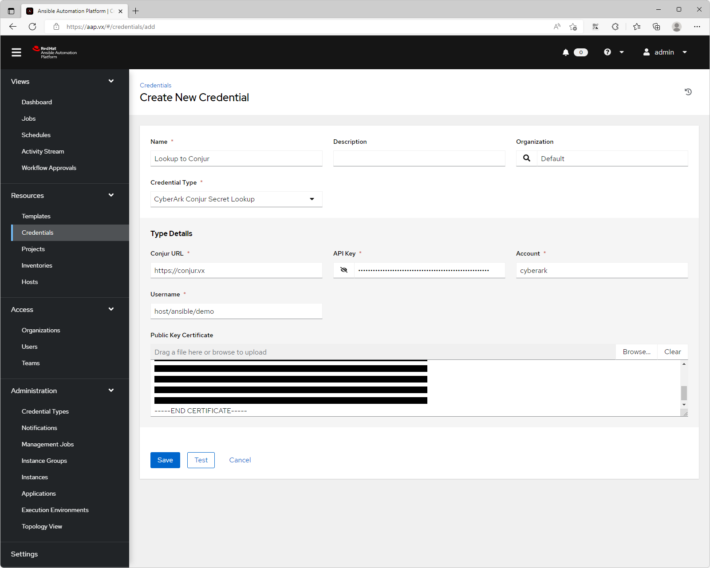

# Integrate Ansible Automation Platorm with CCP and Conjur
## Introduction
- The Ansible Automation Platorm can integrate with both CCP and Conjur products under the CyberArk secrets manager solution
- This guide demonstrates the integration between AAP and CyberArk.

### Software Versions
- RHEL 9.0
- Ansible Automation Platorm [2.2](https://access.redhat.com/documentation/en-us/red_hat_ansible_automation_platform/2.2/html/red_hat_ansible_automation_platform_installation_guide/index)
- Ansible Automation Controller [4.2.1](https://docs.ansible.com/automation-controller/latest/html/userguide/index.html)
- PAM/CCP 12.6
- Conjur Enterprise 12.7.0

### Servers

| Hostname | Role |
| --- | --- |
| cybr.ark.vx | CCP server |
| conjur.vx | Conjur master |
| aap.vx | Ansible Automation Controller |
| foxtrot.vx | Ansible managed node |

# 1. Setup Ansible Automation Platorm

## 1.1. Setup PostgreSQL server

```console
yum -y install postgresql-server
postgresql-setup --initdb
sed -i 's/host    all             all             127.0.0.1\/32            ident/host    all             all             127.0.0.1\/32            md5/' /var/lib/pgsql/data/pg_hba.conf
systemctl enable --now postgresql
firewall-cmd --add-service postgresql --permanent && firewall-cmd --reload
sudo -i -u postgres psql
CREATE USER awx WITH SUPERUSER PASSWORD 'Cyberark1';
CREATE DATABASE awx;
psql -U awx -h 127.0.0.1
rm -f /var/lib/pgsql/.psql_history
```

## 1.2. Install AAP

```console
yum -y install tar
tar xvf ansible-automation-platform-setup-bundle-2.2.1-1.tar.gz
cd ansible-automation-platform-setup-bundle-2.2.1-1
sed -i '/\[automationcontroller\]/a aap.vx ansible_connection=local' inventory
sed -i "s/^admin_password=''/admin_password='Cyberark1'/" inventory
sed -i "s/^pg_host=''/pg_host='127.0.0.1'/" inventory
sed -i "s/^pg_password=''/pg_password='Cyberark1'/" inventory
sed -i "s/registry_username=''/registry_username='joetancybr'/" inventory
sed -i "s/registry_password=''/registry_password='P@ssw0rd'/" inventory
sed -i '/web_server_ssl_key/a web_server_ssl_cert=\/tmp\/aap.pem' inventory
sed -i '/web_server_ssl_key/a web_server_ssl_key=\/tmp\/aap.key' inventory
./setup.sh
```

- Clean-up
```console
cd ..
rm -rf ansible* /tmp/aap*

```

## 1.3. Prepare Ansible playbooks

```console
sudo -i -u awx mkdir /var/lib/awx/projects/cybrdemo
sudo -i -u awx curl -o /var/lib/awx/projects/cybrdemo/helloworld.yaml https://raw.githubusercontent.com/ansible/ansible-tower-samples/master/hello_world.yml
sudo -i -u awx curl -o /var/lib/awx/projects/cybrdemo/webserver.yaml https://raw.githubusercontent.com/joetanx/cybr-aap/main/webserver.yaml
sudo -i -u awx curl -o /var/lib/awx/projects/cybrdemo/index.html.j2 https://raw.githubusercontent.com/joetanx/cybr-aap/main/index.html.j2
```

## 1.4. Configure inventory, host, and project in AAP

Ref: <https://docs.ansible.com/automation-controller/latest/html/quickstart/quick_start.html>


# 2. Prepare Ansible user on managed node
- Create user and set password to `Cyberark1`
```console
useradd ansible
echo -e "Cyberark1\nCyberark1" | (passwd ansible)
echo 'ansible ALL=(ALL) NOPASSWD: ALL' >> /etc/sudoers.d/ansible
```
- su to the ansible user
- Generate ssh key pair and set to `authorized_keys`
```console
su - ansible
mkdir ~/.ssh
ssh-keygen -t rsa -b 2048 -f ~/.ssh/id_rsa -q -N ""
cat /home/ansible/.ssh/id_rsa.pub > /home/ansible/.ssh/authorized_keys
chmod 700 .ssh
chmod 600 .ssh/authorized_keys
```

# 3. Integration with CCP

## 3.1. Onboard SSH keys for ansible user in PAM


## 3.2. Configure Application Identity in PAM


## 3.3. Configure CCP as an external secrets management system


## 3.4. Configure the machine credential for the managed node to lookup from CCP


## 3.5. Setup and launch a Hello World job template


## 3.6. Setup and launch a Web Server job template


# 4. Integration with Conjur

## 4.1. Setup Conjur policy

## 4.2. Store SSH keys for ansible user in Conjur
- Setup Conjur CLI, ref: <https://github.com/cyberark/conjur-api-python3/releases>
```console
curl -L -O https://github.com/cyberark/cyberark-conjur-cli/releases/download/v7.1.0/conjur-cli-rhel-8.tar.gz
tar xvf conjur-cli-rhel-8.tar.gz
mv conjur /usr/local/bin/
```
- Clean-up
```console
rm -f conjur-cli-rhel-8.tar.gz
```
-  Initialize Conjur CLI and login to conjur
```console
conjur init -u https://conjur.vx
conjur login -i admin -p CyberArk123!
```
- Set the Conjur variable value for username and SSH private key
```console
conjur variable set -i ssh_keys/username -v ansible
conjur variable set -i ssh_keys/sshprvkey -v "$(cat /home/ansible/.ssh/id_rsa && echo -e "\r")"
```

## 4.3. Configure Conjur as an external secrets management system




## 4.4. Configure the machine credential for the managed node to lookup from Conjur


## 4.5. Setup and launch a Hello World job template


## 4.6. Setup and launch a Web Server


